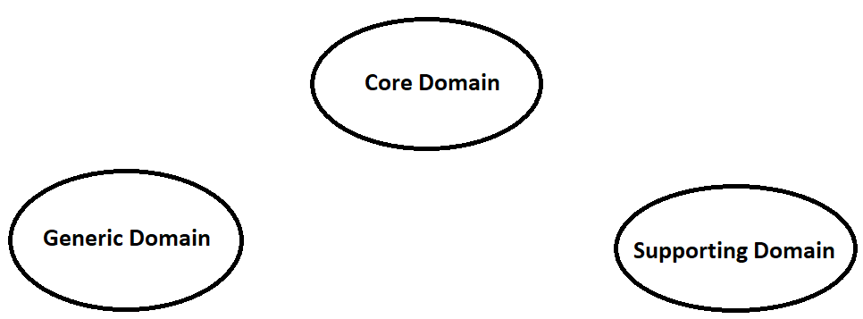
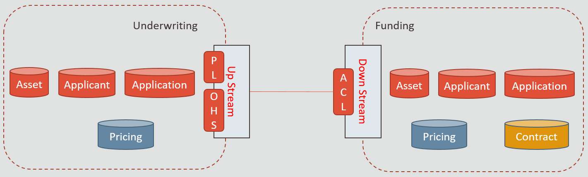
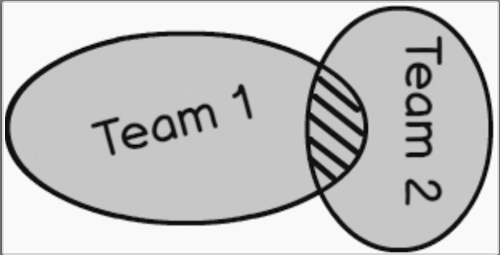
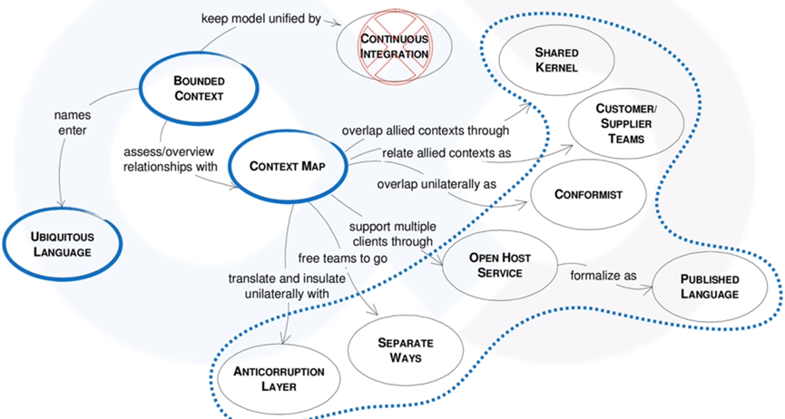

# Basics

## Overview

### Strategic Design
- **Domain Driven Design**(DDD) is a collaboration between technical and domain experts.
- **Domain** is the world of the business we are working with and the problems we want to solve. DDD use domains to break apps into smaller areas according to their *business rules*, *processes* and *existing systems integrations*.
- A Domain is divided into **Sub Domain**, so each sub domains focus smaller problems. These are of three types:
  - **Core domains** are where the money is or primary business is; Example *Underwriting in Lending*.
  - **Supporting domains** support your core business; Example *Revaluation of asset in lending*.
  - **Generic domains** are the ones you need, but don't care a lot about, so you would probably buy them of the shelf; Example *Identity and Access* or *Reporting*.
  
- **Domain Model** is organized and structured knowledge of the problem. It is an object model of the domain that incorporates both behavior and data; Example *Identifying pricing in lending*.
- **Context** is the setting in which a word or statement appears that determines its meaning. Statements about a model can only be understood in a context; Example *policy has a different meaning in insurance vs identity domain*.
- **Bounded Context** is a logical boundary where a certain sub-domain makes sense, while the others don't. Each bounded context contains a domain model that represents a particular subdomain of the larger application. Example *Origination has Application and Collateral Details in Underwriting and Funding sub-domains and there is a logical boundary between these sub-domains*.
  - Relationships between bounded contexts is to classify the contexts as **upstream** and **downstream** contexts. These are managed using **supplier** and **customer** teams.
  
  - **Open Host Service** (OHS) is a formal communication protocol (API) between two subsystems.
  - **Published Language** (PL) is a about publishing the API in a form that other teams can use to write clients.
  - **Anti-Corruption Layer** (ACL) lets the downstream team decides to create an abstraction layer that protects the downstream context from changes in the upstream context.
  - **Shared Kernel** is a common code base that is shared between both contexts. The kernel can be modified by any of the teams, but not without consulting the other team first.
  
  - **Conformist context** are in an upstream-downstream relationship. Upstream team has no motivation to accommodate the downstream team’s needs than the downstream team decides to conform to the model of the upstream team, whatever it happens to be.
  - **Separate Ways** does not perform any integration at all. It depends on the philosophy of; when the benefit of the integration between two contexts is no longer worth the effort, it is better to cut the contexts loose from each other and let them evolve independently. In this, services provided by the upstream context that the downstream context actually used are re-implemented inside the downstream context.
- **Context Map** is designated as the primary tool used to make context boundaries explicit. The context map is responsible for defining an explicit boundary between bounded contexts and makes sure they have a right contact point.
- **Ubiquitous language** is a universal language in a given sub-domain that helps to communicate between software developers and domain experts to connect all the activities . *Event Storming* can be used to achieve a fast cycle of business process learning.

### Tactical Design
- 